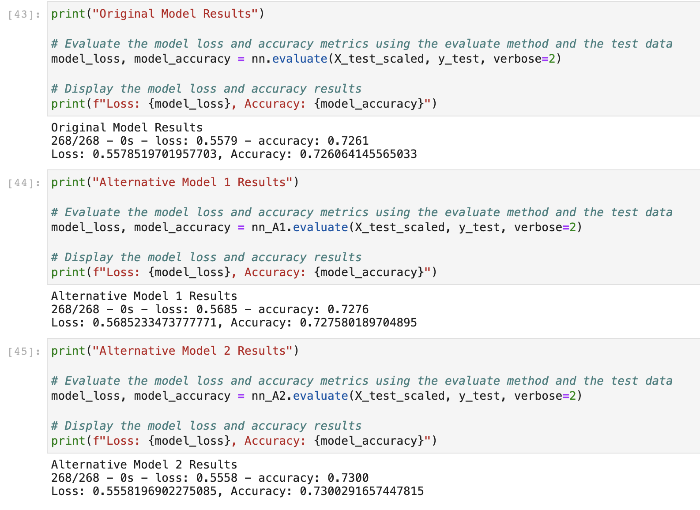
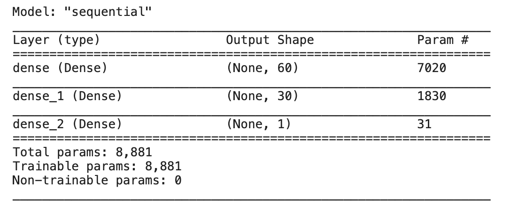
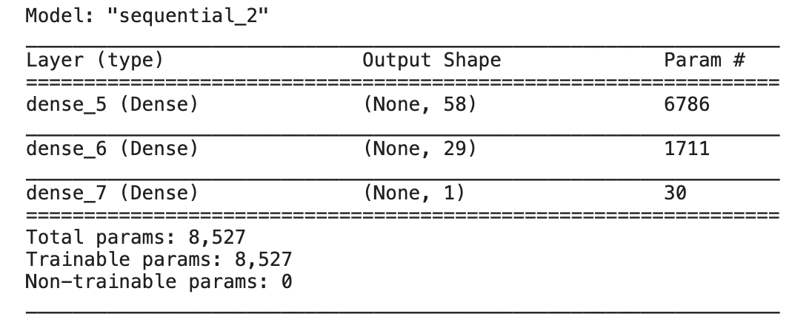

# Module 13 Challenge

This is the repository for my module 13 challenge. In this module challenge, we expanded on our knowledge of machine learning by using neural networks. Our goal was to create a model that predicts whether or not startups would succeed based on a variety of information about each business.

Our first step in this challenge was to prepare the data for use on a neural network model. This involved using tools such as StandardScalar() and OneHotEncoder(), in order to clean our data up and prepare it for the model. 

The second step was to compile and evaluate a binary classification model using a neural network. We used TensorFlow's Keras for this model. We then calculated the model's loss and accuracy.

The final step in this challenge was to optimize our neural network model. We did this twice to explore different methods of optimization. The ultimate goal of this step was to improve the model's accuracy. With the final model, I was able to improve the model's accuracy.

#### Note: I've included all 3 HDF5 files in the 'Resources' folder of this repository. Thanks!

---

## Technologies

Import the following at the beginning of your jupyter notebook:

```python
import pandas as pd
from pathlib import Path
import tensorflow as tf
from tensorflow.keras.layers import Dense
from tensorflow.keras.models import Sequential
from sklearn.model_selection import train_test_split
from sklearn.preprocessing import StandardScaler,OneHotEncoder
```

---

## Example

#### This first image shows the model loss and accuracy values for the original model, the first alternative model, and the second alternative model. Notice the second alternative model performs the best.




#### This next image shows the summary for the original model.




#### This final image shows the summary for the second alternative model, which performed better than all the other models.




---

## Contributors

UCB Fintech Bootcamp, Wynham Guillemot 

---

## License

MIT License

Copyright (c) [2021] [UCB Fintech Bootcamp, Wyham Guillemot]

Permission is hereby granted, free of charge, to any person obtaining a copy
of this software and associated documentation files (the "Software"), to deal
in the Software without restriction, including without limitation the rights
to use, copy, modify, merge, publish, distribute, sublicense, and/or sell
copies of the Software, and to permit persons to whom the Software is
furnished to do so, subject to the following conditions:

The above copyright notice and this permission notice shall be included in all
copies or substantial portions of the Software.

THE SOFTWARE IS PROVIDED "AS IS", WITHOUT WARRANTY OF ANY KIND, EXPRESS OR
IMPLIED, INCLUDING BUT NOT LIMITED TO THE WARRANTIES OF MERCHANTABILITY,
FITNESS FOR A PARTICULAR PURPOSE AND NONINFRINGEMENT. IN NO EVENT SHALL THE
AUTHORS OR COPYRIGHT HOLDERS BE LIABLE FOR ANY CLAIM, DAMAGES OR OTHER
LIABILITY, WHETHER IN AN ACTION OF CONTRACT, TORT OR OTHERWISE, ARISING FROM,
OUT OF OR IN CONNECTION WITH THE SOFTWARE OR THE USE OR OTHER DEALINGS IN THE
SOFTWARE.
